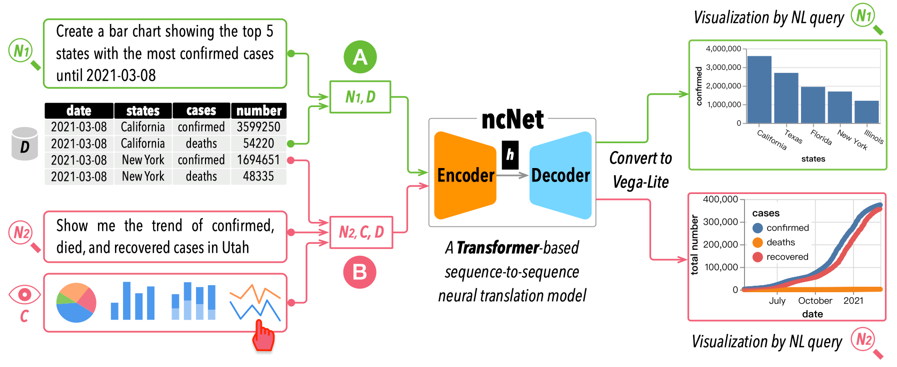
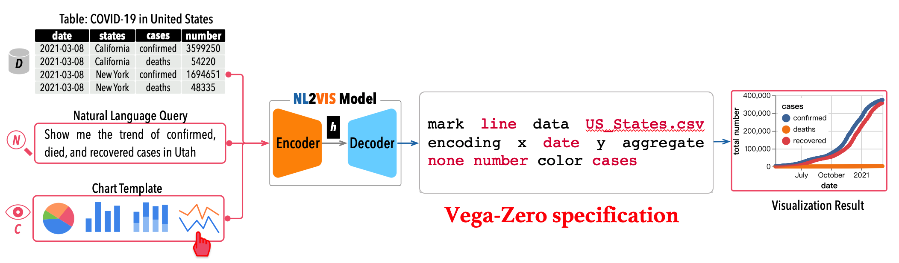
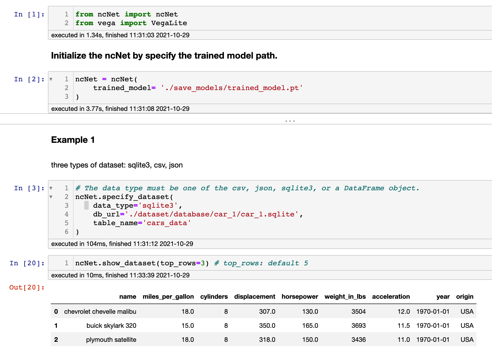
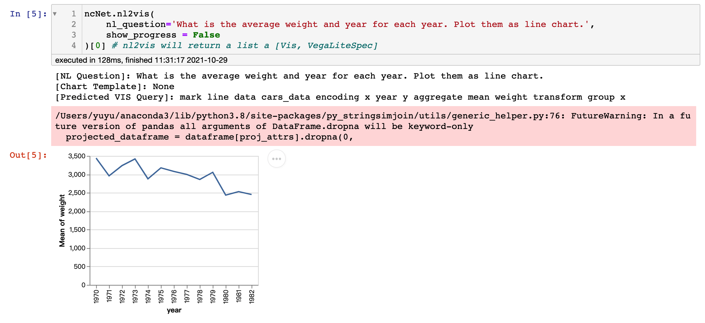

# ncNet

Supporting the translation from natural language (NL) query to visualization (NL2VIS) can simplify the creation of data visualizations because if successful, anyone can generate visualizations by their natural language from the tabular data.



We present <b>ncNet</b>, <i>a Transformer-based model for supporting NL2VIS</i>, with several novel visualization-aware optimizations, including using attention-forcing to optimize the learning process, and visualization-aware rendering to produce better visualization results.

## Input and Output


<b>Input:</b> 
* a tabular dataset (csv, json, or sqlite3) 
* a natural language query used for NL2VIS
* an optional chart template 

<b>Output:</b>
* [Vega-Zero](https://github.com/Thanksyy/Vega-Zero): a sequence-based grammar for model-friendly, by simplifying Vega-Lite


Please refer to our [paper](https://github.com/Thanksyy/Vega-Zero/blob/main/ncNet-VIS21.pdf) at IEEE VIS 2021 for more details.


# Environment Setup

* `Python3.6 or Python3.7`
* `PyTorch 1.7` 
* `torchtext 0.8`
* `ipyvega`

Install Python dependency via `pip install -r requirements.txt` when the environment of Python and Pytorch is setup.


# Running Code

## Data preparation

<!-- * Download [Glove Embedding](xxxxx) and put `glove.6B.100d` under `./dataset/` directory -->

* [Must] Download the Spider data [here](https://drive.google.com/drive/folders/1wmJTcC9R6ah0jBo_ONaZW3ykx5iGMx9j?usp=sharing) and unzip under `./dataset/` directory

* [Optional] **_Only if_** you change the `train/dev/test.csv` under the `./dataset/` folder, you need to run `process_dataset.py` under the `preprocessing` foler. 

## Runing Example

Open the `ncNet.ipynb` to try the running example.




## Training

Run `train.py` to train ncNet.


## Testing

Run `test.py` to eval ncNet.


# Citing ncNet

```bibTeX
@ARTICLE{ncnet,  
author={Luo, Yuyu and Tang, Nan and Li, Guoliang and Tang, Jiawei and Chai, Chengliang and Qin, Xuedi},  
journal={IEEE Transactions on Visualization and Computer Graphics},   
title={Natural Language to Visualization by Neural Machine Translation},   
year={2021},  
volume={},  
number={},  
pages={1-1},  doi={10.1109/TVCG.2021.3114848}}
```

# License
The project is available under the [MIT License](https://github.com/Thanksyy/Vega-Zero/blob/main/README.md).

# Contact
If you have any questions, feel free contact Yuyu Luo (luoyy18 [AT] mails.tsinghua.edu.cn).
